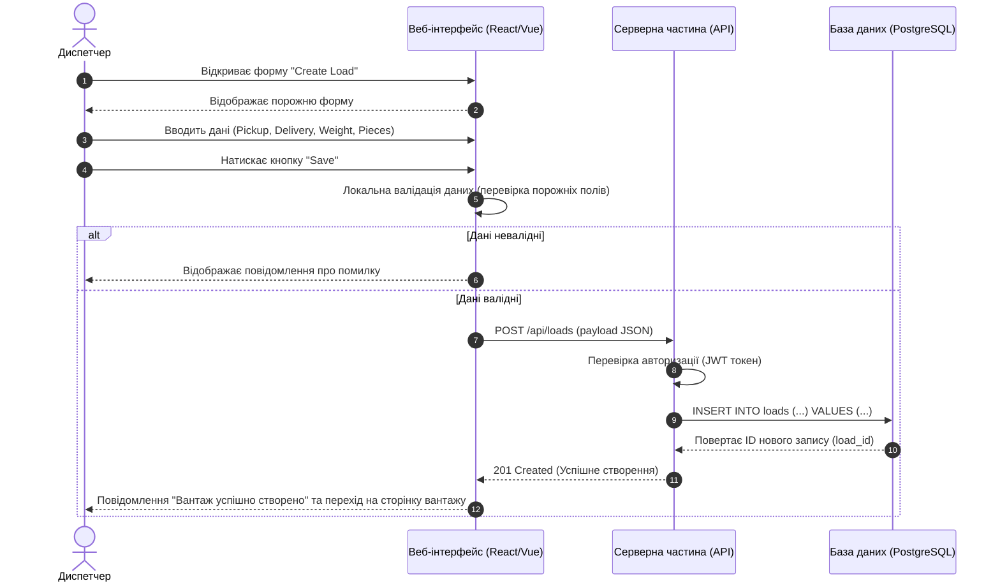
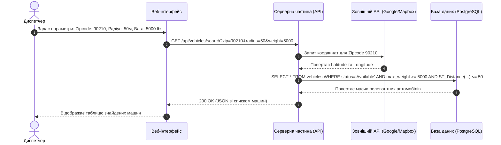

## 5. Відображення User Stories у UML-нотації

### Мал. 1. Діаграма послідовності процесу "Створення вантажу"

```mermaid
sequenceDiagram
    autonumber
    actor Dispatcher as Диспетчер
    participant UI as Веб-інтерфейс (React/Vue)
    participant API as Серверна частина (API)
    participant DB as База даних (PostgreSQL)

    Dispatcher->>UI: Відкриває форму "Create Load"
    UI-->>Dispatcher: Відображає порожню форму
    Dispatcher->>UI: Вводить дані (Pickup, Delivery, Weight, Pieces)
    Dispatcher->>UI: Натискає кнопку "Save"
    
    UI->>UI: Локальна валідація даних (перевірка порожніх полів)
    
    alt Дані невалідні
        UI-->>Dispatcher: Відображає повідомлення про помилку
    else Дані валідні
        UI->>API: POST /api/loads (payload JSON)
        API->>API: Перевірка авторизації (JWT токен)
        API->>DB: INSERT INTO loads (...) VALUES (...)
        DB-->>API: Повертає ID нового запису (load_id)
        API-->>UI: 201 Created (Успішне створення)
        UI-->>Dispatcher: Повідомлення "Вантаж успішно створено" та перехід на сторінку вантажу
    end
```

### Мал. 2. Діаграма послідовності процесу "Пошук автомобіля за фільтрами"

```mermaid
sequenceDiagram
    autonumber
    actor Dispatcher as Диспетчер
    participant UI as Веб-інтерфейс
    participant API as Серверна частина (API)
    participant Geo as Зовнішній API (Google/Mapbox)
    participant DB as База даних (PostgreSQL)

    Dispatcher->>UI: Задає параметри: Zipcode: 90210, Радіус: 50м, Вага: 5000 lbs
    UI->>API: GET /api/vehicles/search?zip=90210&radius=50&weight=5000
    
    API->>Geo: Запит координат для Zipcode 90210
    Geo-->>API: Повертає Latitude та Longitude
    
    API->>DB: SELECT * FROM vehicles WHERE status='Available' AND max_weight >= 5000 AND ST_Distance(...) <= 50
    DB-->>API: Повертає масив релевантних автомобілів
    
    API-->>UI: 200 OK (JSON зі списком машин)
    UI-->>Dispatcher: Відображає таблицю знайдених машин
```