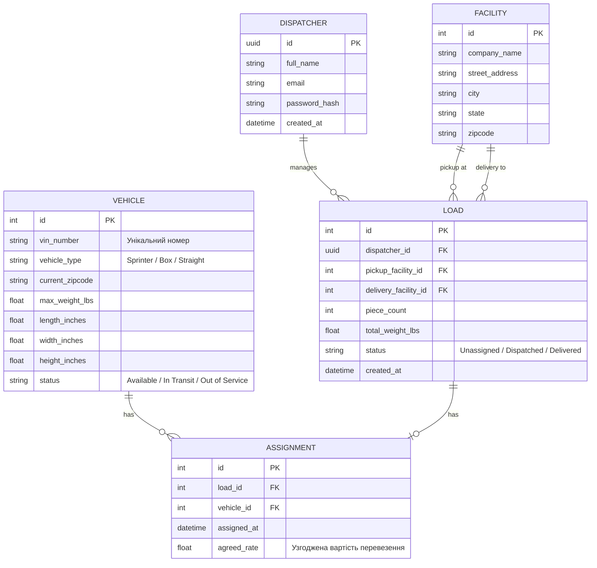

## 7. Побудова моделі даних

Основою системи є структурована реляційна модель даних. Головними сутностями предметної області виступають: Користувач (User), Транспортний засіб (Vehicle), Локація (Facility), Вантаж (Load) та Призначення (Assignment).

Сутність «Транспортний засіб» містить атрибути ідентифікації (унікальний номер), фізичних характеристик (тип, максимальна вага, довжина, ширина, висота) та операційного стану (поточний поштовий індекс, статус зайнятості). Сутність «Локація» зберігає інформацію про географічні точки (назва об'єкта, адреса, місто, штат, поштовий індекс).

Центральною сутністю транзакційного процесу є «Вантаж». Вона пов'язана із сутністю «Локація» двома зв'язками типу «один до багатьох», оскільки кожен вантаж обов'язково має одну точку завантаження та одну точку розвантаження, при цьому на одній локації може оброблятися безліч вантажів. Вантаж також містить специфічні атрибути: кількість одиниць (piece count), загальна вага та поточний статус виконання.

Зв'язок між вантажем та транспортним засобом реалізується через асоціативну сутність «Призначення». Вона вирішує проблему зв'язку «багато до багатьох» у часі (машина може перевозити багато вантажів протягом місяця, а вантаж у разі перевантаження може змінити машину). Атрибутами призначення є ідентифікатори вантажу та авто, час створення запису та узгоджена вартість рейсу.

### Мал. 3. ER-діаграма логістичної інформаційної системи

